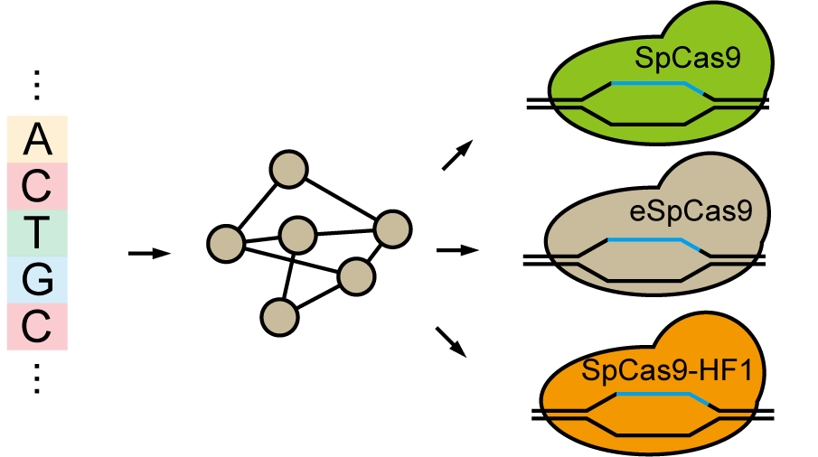
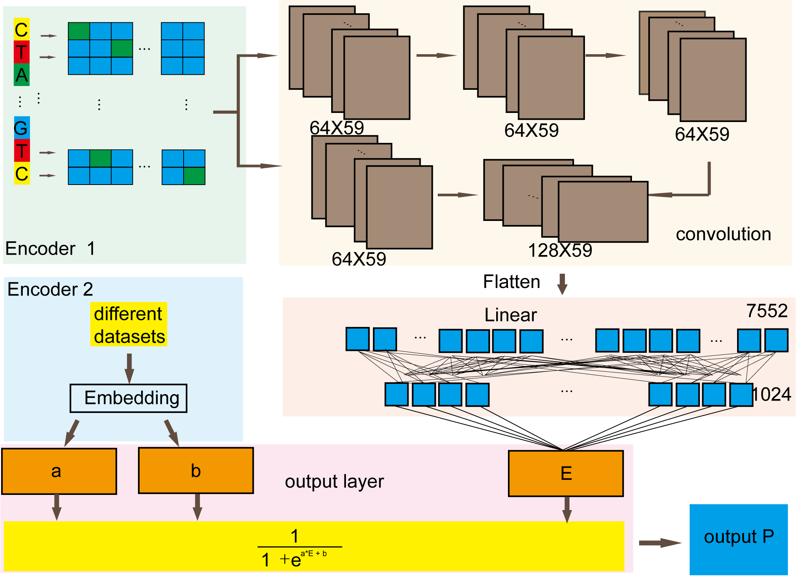

# Uni-deepSG

**Uni-deepSG is a sgRNA eff prediction tools.**
If you use any code in this repository, please kindly cite our paper: "Z. C. Zhong, Z. Y. Li, J. Yang and Qian Wang, Unified Model to Predict gRNA Efficiency across Diverse Cell Lines and CRISPR-Cas9 Systems, Journal of Chemical Information and Modeling". Thank you.

using $eff=\frac{1}{1+\cdot e^{(A ener+B)}}$ to combine CAS9 variants together. so the model can train different CAS9 or in different labs 

**requrments:**

python==3.8.0  
numpy==1.23.5  
pytorch==2.0.1+cu117    

**source data path**: ./main/source_data  

**model training**  
if you want to train the model, in ./main/TrainModel/ run temtrain.py.  
if you want to add new items, please check the format in ./main/TrainModel/data/ remeber to add the scarfford. the scarfford format is in "./main/TrainModel/AddScarfford.ipynb" 
the model is showing as follow:  

 

**predict tools**  
to make sgrna format correctly, choosing "normal" for normal scarfford, "abnormal" for scarfford using in Kim et al 2020.
if you want to predict one sgrna eff, in ./main/PredictionTools run predict.ipynb. change the sgrna variable in "cell 2" 23bp is need.

if you want to predict batches of sgrna in ./main/BatchPrediction/ run predict.ipynb. input file example is at ./main/BatchPredition/data/esp_format_23bp_eff.npy
In this model, if you want to predict multiple sequences and want to minimize the mean squared error (MSE), you can adjust the parameters A and B with input a small number of template sequence(10 for example) within your cas9 variants or laboratory. This adjustment can help improve the prediction results. It's important to note that this process will not affect the Spearman correlation.
